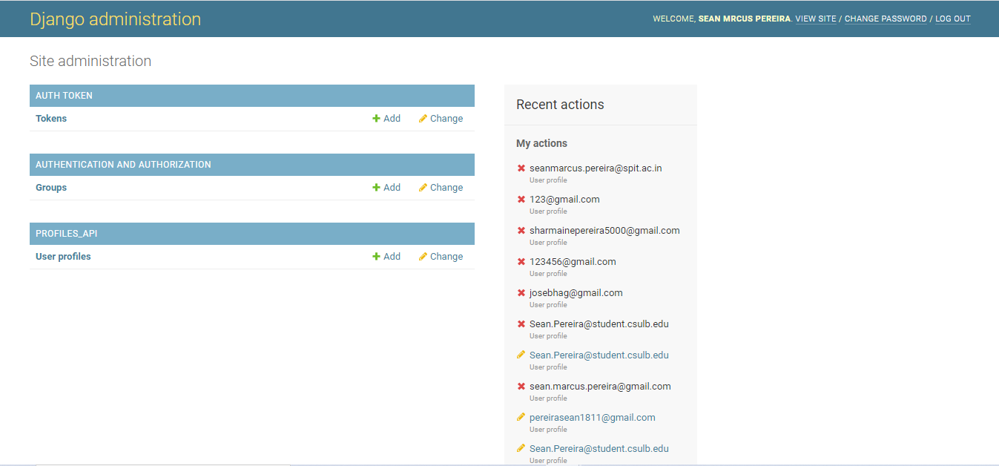

# CYBER DIVE CODING PROJECT

  <ol>
  <li>To install all the dependencies for the project, use this command on your local machine terminal- pip install -r requirements.txt</li>
  <li>Super user credentials</li>
    <ul>
      <li>Email: pereirasean1811@gmail.com
      <li>Name: Sean Pereira
      <li>pass: pass1234
    </ul>
  <li> In this project, to unable token authorization,you will have to add browser extension called ModHeader, this is the link where you can download https://chrome.google.com/webstore/detail/modheader/idgpnmonknjnojddfkpgkljpfnnfcklj?hl=en</li>
  </ol>
  
 ## How to run the project
 
  <ol>
  <li> run python manage.py runserver command in your command prompt to start the Django app</li>
  <li> Paste http://127.0.0.1:8000/admin/ in your browser and enter your superuser credentials</li>
  ## preview of the web page
  
  </ol>
  

  
